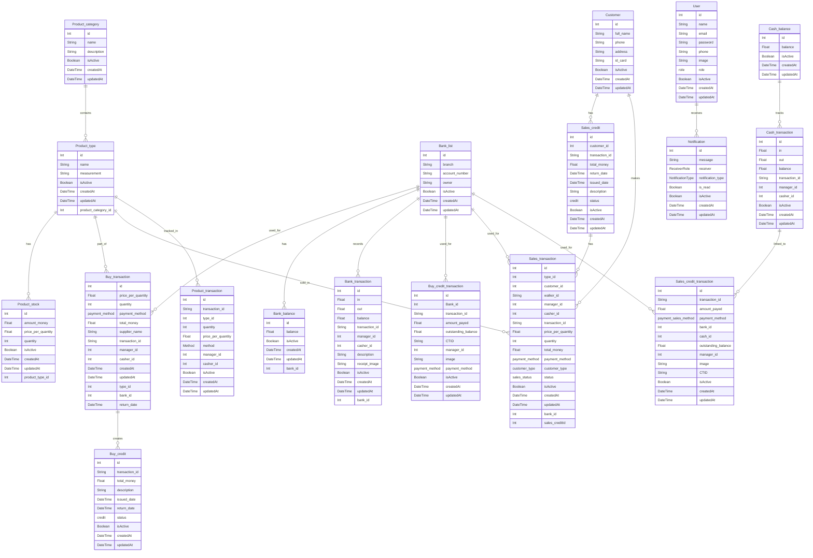

# Database Schema Diagram - Full Model

```mermaid
erDiagram
    User {
        Int id
        String name
        String email
        String password
        String phone
        String image
        role role
        Boolean isActive
        DateTime createdAt
        DateTime updatedAt
    }

    Customer {
        Int id
        String full_name
        String phone
        String address
        String id_card
        Boolean isActive
        DateTime createdAt
        DateTime updatedAt
    }

    Product_category {
        Int id
        String name
        String description
        Boolean isActive
        DateTime createdAt
        DateTime updatedAt
    }

    Product_type {
        Int id
        String name
        String measurement
        Boolean isActive
        DateTime createdAt
        DateTime updatedAt
        Int product_category_id
    }

    Product_stock {
        Int id
        Float amount_money
        Float price_per_quantity
        Int quantity
        Boolean isActive
        DateTime createdAt
        DateTime updatedAt
        Int product_type_id
    }

    Bank_list {
        Int id
        String branch
        String account_number
        String owner
        Boolean isActive
        DateTime createdAt
        DateTime updatedAt
    }

    Buy_transaction {
        Int id
        Float price_per_quantity
        Int quantity
        payment_method payment_method
        Float total_money
        String supplier_name
        String transaction_id
        Int manager_id
        Int casher_id
        DateTime createdAt
        DateTime updatedAt
        Int type_id
        Int bank_id
        DateTime return_date
    }

    Buy_credit {
        Int id
        String transaction_id
        Float total_money
        String description
        DateTime issued_date
        DateTime return_date
        credit status
        Boolean isActive
        DateTime createdAt
        DateTime updatedAt
    }

    Bank_balance {
        Int id
        Float balance
        Boolean isActive
        DateTime createdAt
        DateTime updatedAt
        Int bank_id
    }

    Bank_transaction {
        Int id
        Float in
        Float out
        Float balance
        String transaction_id
        Int manager_id
        Int casher_id
        String description
        String receipt_image
        Boolean isActive
        DateTime createdAt
        DateTime updatedAt
        Int bank_id
    }

    Buy_credit_transaction {
        Int id
        Int Bank_id
        String transaction_id
        Float amount_payed
        Float outstanding_balance
        String CTID
        Int manager_id
        String image
        payment_method payment_method
        Boolean isActive
        DateTime createdAt
        DateTime updatedAt
    }

    Cash_balance {
        Int id
        Float balance
        Boolean isActive
        DateTime createdAt
        DateTime updatedAt
    }

    Cash_transaction {
        Int id
        Float in
        Float out
        Float balance
        String transaction_id
        Int manager_id
        Int casher_id
        Boolean isActive
        DateTime createdAt
        DateTime updatedAt
    }

    Sales_transaction {
        Int id
        Int type_id
        Int customer_id
        String walker_id
        Int manager_id
        Int casher_id
        String transaction_id
        Float price_per_quantity
        Int quantity
        Float total_money
        payment_method payment_method
        customer_type customer_type
        sales_status status
        Boolean isActive
        DateTime createdAt
        DateTime updatedAt
        Int bank_id
        Int sales_creditId
    }

    Sales_credit {
        Int id
        Int customer_id
        String transaction_id
        Float total_money
        DateTime return_date
        DateTime issued_date
        String description
        credit status
        Boolean isActive
        DateTime createdAt
        DateTime updatedAt
    }

    Sales_credit_transaction {
        Int id
        String transaction_id
        Float amount_payed
        payment_sales_method payment_method
        Int bank_id
        Int cash_id
        Float outstanding_balance
        Int manager_id
        String image
        String CTID
        Boolean isActive
        DateTime createdAt
        DateTime updatedAt
    }

    Product_transaction {
        Int id
        String transaction_id
        Int type_id
        Int quantity
        Float price_per_quantity
        Method method
        Int manager_id
        Int casher_id
        Boolean isActive
        DateTime createdAt
        DateTime updatedAt
    }

    Notification {
        Int id
        String message
        ReceiverRole receiver
        NotificationType notification_type
        Boolean is_read
        Boolean isActive
        DateTime createdAt
        DateTime updatedAt
    }

    %% Relationships
    User ||--o{ Notification : "receives"

    Customer ||--o{ Sales_credit : "has"
    Customer ||--o{ Sales_transaction : "makes"

    Product_category ||--o{ Product_type : "contains"
    Product_type ||--o{ Product_stock : "has"
    Product_type ||--o{ Buy_transaction : "part_of"
    Product_type ||--o{ Sales_transaction : "sold_in"
    Product_type ||--o{ Product_transaction : "tracked_in"

    Bank_list ||--o{ Buy_transaction : "used_for"
    Bank_list ||--o{ Bank_balance : "has"
    Bank_list ||--o{ Bank_transaction : "records"
    Bank_list ||--o{ Buy_credit_transaction : "used_for"
    Bank_list ||--o{ Sales_transaction : "used_for"
    Bank_list ||--o{ Sales_credit_transaction : "used_for"

    Sales_credit ||--o{ Sales_transaction : "has"

    Cash_balance ||--o{ Cash_transaction : "tracks"
    Cash_transaction ||--o{ Sales_credit_transaction : "linked_to"

    Buy_transaction ||--o{ Buy_credit : "creates"
```
